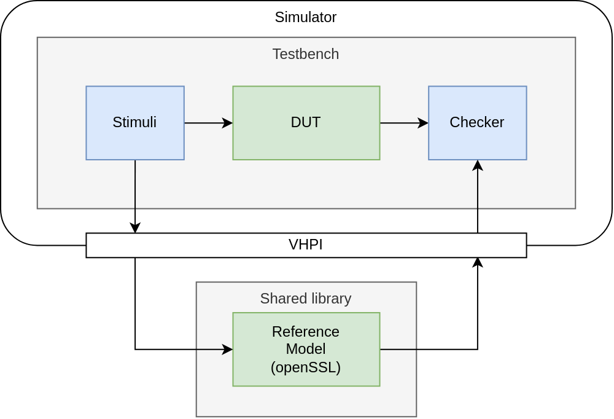
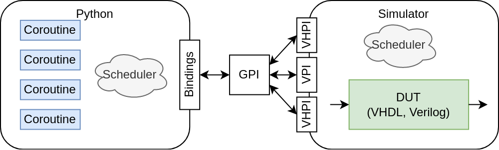
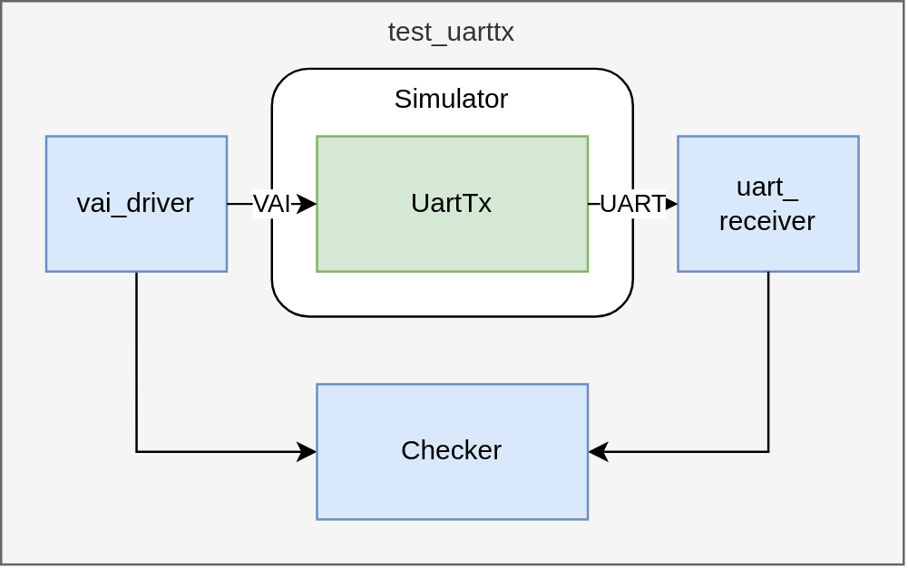
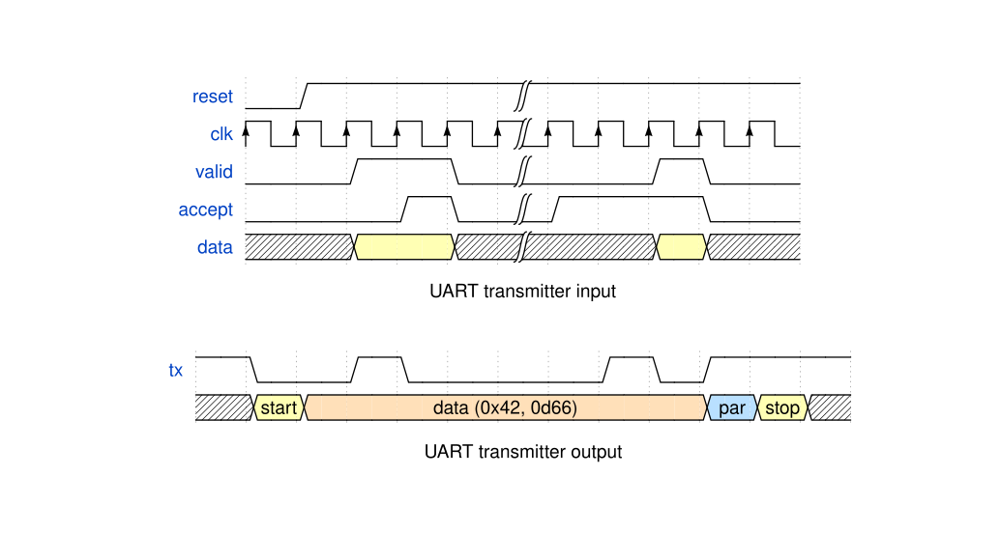

---
title: Using Python for Verification of Digital Systems
subtitle: QZ 2021
author:
- Torsten Meißner
- torsten.meissner@secunet.com
date: February 2022
...

# Overview

* Introduction

* Functional Verification
* Co-Simulation

* Cocotb

* Python Packages

* Live Demo

* Summary

# Introduction

## FPGA-Workflow

1. Specification
2. Design entry
3. **Verification**
4. Synthesis
5. Device Mapping
6. Place & Route
7. Static Timing Analysis
8. Programming file generation

# Introduction

## Design Entry

1. Schematic Entry
2. **Hardware Description Languages (RTL)**
  * **(System)Verilog**
  * **VHDL**
3. High level languages
  * System C
  * Bluespec
  * Chisel
  * nmigen

# Functional Verification

1. **Functional Verification**
  * **Simulation**
  * Emulation
2. Formal Verification
  * Property checking
  * Equivalence checking
3. Lab Tests
  * Target platform
  * Logic Analyzer
  * Oscilloscope

# Functional Verification

## Simulation

* Executing of design description in a simulator
* Test benches as infrastructure (HDL, C, etc.)
* Reference models (HDL, C, etc.)
* Directed & Random tests
* Code & functional Coverage
* Assertion Based Verification (PSL, SVA)
* Verification Frameworks (UVM, OSVVM, vUnit, etc.)
* Co-Simulation

# HDL Simulation

 

# Co-Simulation

- Simulation with access to/from external program code
- Linked per shared library

## HDL Programming Interfaces

- VHDL Procedural Interface (VHPI)
- Verilog Procedural Interface (VPI)
- Proprietary interfaces (FLI)
- Access data in VHDL models in the simulator

## Features

- Static VHDL Design Data (Traverse hierarchy etc.)
- Dynamic VHDL Objects (R/W values of VHDL objects)
- Interaction and control (Callbacks as comm. mechanism between simulator user code)
- Foreign model instantiation and intercommunication

# Co-Simulation with SW reference Model

HDL testbench controls program flow

# Cocotb

- COroutine based COsimulation TestBench environment
- Verifying HDL designs with Python
- HDL normally only used for design, not the testbench
- Simulator only used to execute DUT RTL description
- Supports many simulators (Free & proprietary)
- Free & open-source, active community

##

- High-level, multi-paradigm language
- Writing Python is fast - **very productive** language.
- **Easy interfacing** to other languages from Python
- **Huge library** of existing code to re-use
- **Interpreted** - tests can be edited and re-run w/o recompiling the design
- **Popular** - far more engineers know Python than Verilog / VHDL
- Working and reliable packet manager (PyPI)

# Cocotb Co-Simulation

Python testbench controls program flow

# Cocotb Design Interaction

## Accessing Design

- *dut* as handle to toplevel instantiation
- Access to toplevel and other signals with dot-notation

~~~~ {.python .stretch}
# Reference to toplevel clock input
clk = dut.clk_i
# Reference to signal in sub-unit
cpu_pc = dut.cpu.regfile.pc
~~~~

## Read / Write Values from Signals

- Via handle's *value* property
- Direct R/W access through the hierarchy

~~~~ {.python .stretch}
# Via value property
valid = dut.valid_i.value
if valid.value == 0:
    valid.value = 1
# Direct access through hierarchy
if dut.reset_i.value == 1:
    dut.cpu.regfile.pc.value = 0
~~~~

# Cocotb concurrent & sequential execution

## *async*: Mark Functions & Methods as Coroutines

~~~~ {.python .stretch}
async def reset(signal, time,):
    signal.value = 0
    # Block execution, wait for simulator time advances by 100 ns
    await Timer(time, units='ns')  # cocotb built-in class
    signal.value = 1
~~~~

##  *await*: Wait for other Coroutines or Simulator

- Block on another coroutines execution
- Pass control of execution back to simulator, allowing simulation time to advance

~~~~ {.python .stretch}
print("Hold reset")
await reset(dut.reset_i)
print("Released reset")
~~~~

# Cocotb concurrent execution

## *start()*

1. Schedules the new coroutine to be executed concurrently
2. Yields control to allow the new task (& any other pending tasks) to run
3. Resumes the calling task

~~~~ {.python .stretch}
await cocotb.start(reset(dut.reset_i, 100)

await Timer(90, units='ns')
print(f"Reset is still active: {dut.reset_i.value}")
await Timer(15, units='ns')
print(f"Reset has gone inactive: {dut.reset_i.value}")
~~~~

## *start_soon()*:

- Schedules the new coroutine for future execution, after the calling task yields control

~~~~ {.python .stretch}
clock = Clock(dut.clk_i, 10, units="ns")  # Create a clock, cocotb built-in class
cocotb.start_soon(clock.start())          # Start the clock concurrently
~~~~

# Cocotb test functions

## *@cocotb.test()* Decorator

- Mark a callable which returns a coroutine as a test
- Provides a test timeout
- Allows to mark tests as skipped or expecting errors or failures
- Tests are evaluated in the order of their definition in a test module

~~~~ {.python .stretch}
@cocotb.test()
async def test_aes_init(dut):
    """ Test AES initialization """
...
@cocotb.test()
async def test_aes_enc(dut):
    """ Test AES encryption """
...
# This test is skipped from execution
@cocotb.test(skip=True)
async def test_aes_enc(dut):
    """ Test AES encryption """
~~~~

# Cocotb Triggers

- Indicate when cocotb scheduler should resume coroutine execution
- Triggers should be awaited by coroutines
  - Cause execution of the current coroutine to pause
  - Execution of paused coroutine will resumes when trigger fires
- Triggers for simulator events, task synchronization etc.

~~~~ {.python .stretch}
# Wait for 100 ns
await Timer(100, units='ns')

# Wait for rising clock edge
await RisingEdge(dut.clk_i)

# Wait for 10 clock cycles
await ClockCycles(dut.clk_i, 10)

# Fires when first trigger in fires & returns its result
t1 = Timer(10, units='ns')
t2 = Timer(15, units='ns')
t_ret = await First(t1, t2)  # returns after 10 ns simulation time
~~~~

# Cocotb Example: Verifying a UART transmitter

 

# Cocotb Example: Verifying a UART transmitter

##

# Cocotb Example: Verifying a UART transmitter

## Valid-Accept Driver Model

~~~~ {.python .stretch}
async def send(self, data, sync=True):
    if sync:
        await self._clkedge

    self._valid.value = 1

    if isinstance(self._data, list):
        for i in range(len(self._data)):
            self._data[i].value = data[i]

    else:
        self._data.value = data

    while True:
        await ReadOnly()
        if self._accept.value:
            break
        await self._clkedge
    await self._clkedge

    self._valid.value = 0
~~~~

# Cocotb Example: Verifying a UART transmitter

## UART Receiver Model

~~~~ {.python .stretch}
async def receive(self):
    # Wait for frame start
    await FallingEdge(self._txrx)

    # Consume start bit
    await self._get_start_bit()

    # Receive data bits
    self._rec = 0
    for x in range(self._bits):
        await self._wait_cycle()
        await ReadOnly()
        self._rec |= bool(self._txrx.value.integer) << x

    if self._par:
        # Consume parity bit
        await self._get_parity_bit()

    # Consume stop bit
    await self._get_stop_bit()

    return self._rec
~~~~

# Cocotb Example: Verifying a UART transmitter

## Test function

~~~~ {.python .stretch}
@cocotb.test()
async def test_uarttx(dut):

    # Instantiate VAI driver & UART receiver
    vai_driver = VaiDriver(dut.clk_i, dut.data_i, dut.valid_i, dut.accept_o)
    uart_receiver = UartReceiver(dut.tx_o, dut.clk_i, 10, 8, True);

    # Drive input defaults (setimmediatevalue to avoid x asserts)
    dut.data_i.setimmediatevalue(0)
    dut.valid_i.setimmediatevalue(0)

    cocotb.start_soon(Clock(dut.clk_i, 10, units="ns").start())  # Start the clock
    await reset(dut.reset_n_i, 100)  # Block until reset() has completed

    # Test 10 UART transmissions
    for i in range(256):
        await RisingEdge(dut.clk_i)
        await vai_driver.send(i)
        rec = await uart_receiver.receive();
        assert rec == i, "UART sent data was incorrect on the {}th cycle".format(i)
~~~~

# Cocotb Example: Verifying a UART transmitter

~~~~ {.shell .stretch}
loading VPI module '/usr/local/lib/python3.9/dist-packages/cocotb/libs/libcocotbvpi_ghdl.so'
     -.--ns INFO     cocotb.gpi ../gpi/GpiCommon.cpp:99 in gpi_print_registered_impl VPI registered
VPI module loaded!
     0.00ns INFO     Running on GHDL version 2.0.0-dev (v1.0.0-974-g0e46300c) [Dunoon edition]
     0.00ns INFO     Running tests with cocotb v1.7.0.dev0 from /usr/local/lib/python3.9/...
     0.00ns INFO     Seeding Python random module with 1644512771
     0.00ns INFO     Found test tb_uarttx.test_uarttx
     0.00ns INFO     running test_uarttx (1/1)
                       First simple test
     0.00ns INFO     Valid-accept driver
     0.00ns INFO       cocotbext-vai version 0.0.1
     0.00ns INFO       Copyright (c) 2022 Torsten Meissner
     0.00ns INFO     UART receiver
     0.00ns INFO       cocotbext-uart version 0.0.1
     0.00ns INFO       Copyright (c) 2022 Torsten Meissner
   100.00ns INFO     Released reset
   110.00ns INFO     Send data:    0xb6
                     ...
 11160.00ns INFO     Received data: 0xd8
 11160.00ns INFO     test_uarttx passed
 11160.00ns INFO     **********************************************************************
                     ** TEST                          STATUS  SIM TIME (ns)  REAL TIME (s) 
                     **********************************************************************
                     ** tb_uarttx.test_uarttx          PASS       11160.00           0.21  
                     **********************************************************************
                     ** TESTS=1 PASS=1 FAIL=0 SKIP=0              11160.00           0.22  
                     **********************************************************************
~~~~

# Python Packages

## Cocotb related

- Reusable packages for cocotb testbenches
- Bus protocols, reference models etc.
- Verification libraries
  - pyuvm
  - cocotb-coverage
  - uvm-python
- Depending on cocotb

## Python generic

- Generic Python packages useful for verification
  - pyvsc
  - pyucis
- Whole Python ecosystem
- Not depending on cocotb

# Python Packages: pyvsc

## Python library for Verification Stimulus and Coverage

- Random verification-stimulus generation
- Functional coverage collection
- Implemented in pure Python
- Uses Boolector SMT-solver for solving user-defined constraints

~~~~ {.python .stretch}
@vsc.randobj
class my_cr():
    def __init__(self):
        self.a = vsc.rand_bit_t(8)
        self.b = vsc.rand_bit_t(8)

     @vsc.constraint
     def ab_c(self):
         self.a != 0
         self.a <= self.b
         self.b in vsc.rangelist(1,2,4,8)
~~~~

# Live Demo

## UART transmitter & receiver
- Simple tests using self written Python models for VAI & UART

## Wishbone slave with local SRAM interface
- Using cocotbext-wishbone package from PyPI

## AES128 en- and decryption
- Using pyvsc for constrained random & functional coverage
- Using Pycrypto for AES reference

# Summary

- Easy to use
- Good documentation
- In active development with regular releases
- Free and open-source
- Allows Python SW-developers to verify digital systems
- Supports all major simulators used by FPGA teams

## Presentation's code examples

* https://github.com/tmeissner/cocotb_with_ghdl

## References

* https://github.com/cocotb/cocotb
* https://github.com/fvutils/pyvsc
* https://github.com/wallento/cocotbext-wishbone

# Extras: Accessing signals

## *dut.signal.value = 1*

- Value is stored by the Scheduler
- All stored values are written at the same time at the end of the current simulator time step

## *.setimmediatevalue()*

- Value is assigned to this simulation object immediately

## Access to elements of indexable objects (arrays etc.)

~~~~ {.python .stretch}
dut.some_array[0].value = 1
~~~~

- Bit order depends on the HDL object (*to* or *downto*)

# Extras: Accessing signals

## Reading synchronous signals

- Returns after clock changes, but no sympathetic signals changed yet
- Sampling any signal here returns values settled during previous clock cycle
- Equivalent to registered processes in HDLs

## *ReadOnly()*

- Triggers in the postpone phase
- All signals have settled
- No more updates may occur on the clock edge event
- Sampling any signal here returns values settled in current clock cycle

# Extras: Accessing signals

